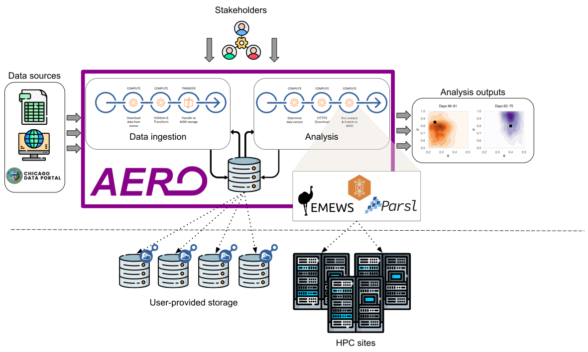

# AERO client

AERO tracks versioned data sources and reruns the analyses that depend on them. When a source
changes, every analysis derived from it runs again automatically, and each result is recorded as a
new version linked back to the inputs it came from.

`aero-client` is the command-line tool and Python library you use to talk to an AERO server: it
registers sources and analysis flows, lists what AERO knows about, and provides the wrappers that
your ingestion and analysis functions run inside on a Globus Compute endpoint.

## Installation

```sh
pip install -e .            # from a checkout
```

Python 3.11 or newer. If your analysis functions will run on a Globus Compute endpoint, install the
client into that endpoint's environment too — and **register functions from a Python minor version
matching the endpoint's**, or the endpoint will fail to deserialize them.

## Quickstart

Five steps from a fresh install to an analysis that reruns on its own.

**1. Configure and authenticate.** Point the client at your AERO server and log in:

```sh
aero configure -f config.toml
aero list                      # first call opens a Globus login
```

See [Configuration](configuration.md) for what goes in `config.toml` and the Globus credentials
you need alongside it.

**2. Register a source.** This one tracks a MinIO object by reference, without copying it:

```sh
aero create --name "traffic reports" --type traffic --no-copy \
  --url http://minio.internal:9000/traffic/report.xml.gz
```

It prints a **data id** — the UUID everything else refers to.

**3. Write and register an analysis function.** It takes the input by name and returns an
`AeroOutput`, or `None` if it stores its own results. See [Writing functions](writing-functions.md):

```sh
python my_analysis.py          # prints a Globus Compute function uuid
```

**4. Register the analysis flow** against the data id from step 2:

```sh
aero register -f analysis.yaml
```

**5. Change the source.** Notify AERO (usually from an object-store event) and the analysis runs
with the object that changed.

## Where things are

| | |
|---|---|
| [Configuration](configuration.md) | `config.toml`, profiles, Globus credentials, collection permissions |
| [CLI reference](cli.md) | Every command, with examples and the YAML each accepts |
| [Writing functions](writing-functions.md) | What your ingestion and analysis functions must look like |

## Concepts worth knowing first

A **source** is a `Data` record with a series of versions. AERO stores metadata about it; whether it
stores the bytes is up to you.

A **copy** source is pulled and staged into a Globus guest collection, so AERO holds its own copy. A
**no-copy** source records a new version from the change event alone — nothing is pulled and no
bytes move, and the analysis reads the object directly from its URL. No-copy needs no collection,
no Globus Compute endpoint, and no ingestion function.

A **type** groups several objects under one source, so a change to any of them drives the same
analysis. Objects can be listed individually or matched by a glob pattern.

A **flow** is either an ingestion (produces a source) or an analysis (consumes one or more sources
and reruns when they change). A flow's **policy** decides what triggers it.
